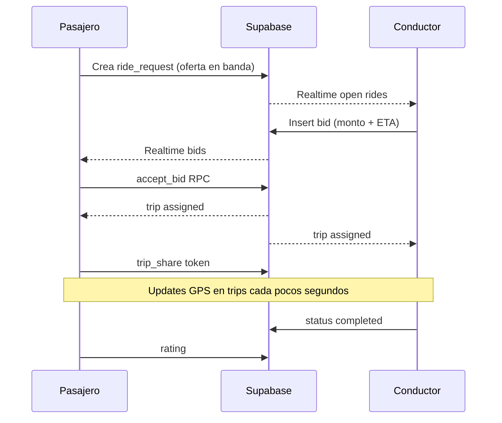

# Trato — Arquitectura MVP (stack gratuito)

## Decisiones

| Tema | Elección | Por qué |
| --- | --- | --- |
| Repo | Carpeta `/trato` nueva (no toca LabFlow) | Proyecto independiente |
| Cliente 1 | Next.js 16 PWA mobile-first | Deploy gratis en Vercel, instalable |
| Cliente 2 | Expo (fase 2) | GPS/background + push nativos |
| Backend | Supabase Free | Auth + Postgres + Realtime + Storage sin servidor propio |
| Mapas | MapLibre + tiles OSM | Sin API key de Google |
| Routing | Haversine + fórmula de tarifa local | Sin coste de Directions API |
| Pagos MVP | Efectivo / transferencia acordada | Evita fees; digital en fase 3 |

## Carencias que atacamos

### Uber
- Precio opaco / surge → **banda min–sugerido–max** visible
- Cero negociación → **oferta del pasajero + contraoferta del conductor**
- Cancelaciones asimétricas → trust score + contadores visibles

### InDrive
- Negociación interminable → **bids cortos dentro del rango + auto-expiración 15 min**
- Sensación de inseguridad → **compartir viaje público**, placa/vehículo, trust
- UX áspera → sheet móvil, mapa primero, un trato a la vez

## Innovaciones MVP

1. **Fair band**: tarifa sugerida ± banda según distancia/tiempo.
2. **Dual bid**: pasajero fija oferta; conductor propone ETA + monto.
3. **Trust score** bilateral (estrellas + trips − cancelaciones).
4. **Share live**: link anónimo de seguimiento (`/s/[token]`).
5. **PWA installable** + roadmap Expo con tipos compartidos.

## Límites free (diseño consciente)

- Supabase: 500 MB DB, 50k MAU, 200 conexiones Realtime, pausa tras 7 días inactivo.
- Estrategia: throttlear updates de GPS (~4–8 s), no broadcast de flota completa.
- OSM tiles: uso razonable; cachear viewport.

## Flujo



## Estructura

```
trato/
  src/app          PWA Next.js
  src/lib          fare, geo, supabase
  packages/shared  tipos compartidos (Expo)
  apps/expo        placeholder fase 2
  docs/            arquitectura + roadmap Expo
  supabase/        SQL de referencia
```

## Fases

1. **MVP PWA** (ahora): auth, request, bids, trip, share, rating.
2. **Expo**: misma API Supabase, GPS background, push.
3. **Pagos**: Yape/Plin QR o Stripe/Mercado Pago cuando haya volumen.
